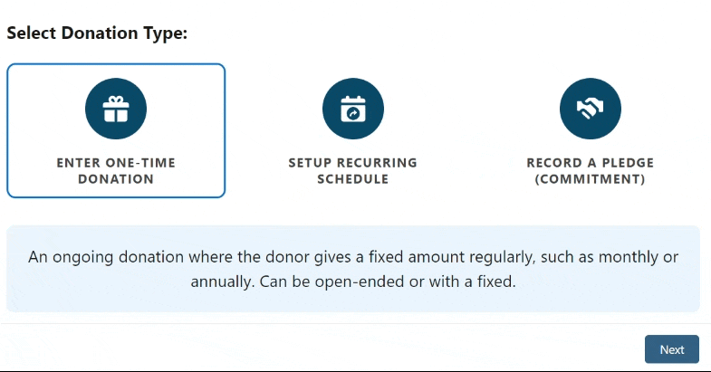

# Icon-Button-Group-LWC
LWC component that displays a group of buttons, handles selection, and provides info based on the selected button. Outputs the selected value to the parent or a flow




## Features

- **Dynamic Button Rendering**: Accepts a JSON string to dynamically generate buttons with labels and icons.
- **Default Button Selection**: Allows a default button to be selected on load.
- **Information Display**: Displays additional information related to each button when hovered over or selected.
- **Custom Event Output**: Dispatches a `buttonselect` event with the selected button’s value, allowing the parent components or flow to capture the selected button's value.

## Installation

### 1. Install the Unmanaged Package:
Install the unmanaged package from this link: [Install IconButtonGroup LWC](https://login.salesforce.com/packaging/installPackage.apexp?p0=04taj0000003C6H&isdtp=p1).

### 2. Deploy from GitHub:
You can also clone this repository and deploy it manually using Salesforce CLI or any other deployment tool:

```bash
git clone https://github.com/yourusername/Icon-Button-Group-LWC.git
cd Icon-Button-Group-LWC
sfdx force:source:deploy -p force-app
```

## Sample JSON

A sample of a string that can be passed into the buttonsJson input:
```bash
[
    {
        "value": "generalDonation",
        "icon": "standard:thanks",
        "label": "Enter One-time Donation",
        "infoText": "A one-time donation made by an individual, organization, or business."
    },
    {
        "value": "recurringDonation",
        "icon": "standard:shift_scheduling_operation",
        "label": "Setup Recurring Schedule",
        "infoText": " An ongoing donation where the donor gives a fixed amount regularly, such as monthly or annually. Can be open-ended or with a fixed. "
    },
    {
        "value": "pledge",
        "icon": "standard:partners",
        "label": "Record a Pledge (Commitment)",
        "infoText": "A commitment to donate a specified amount to be paid in a lump sump or installments in the future."
    }
]
```

## License

This project is licensed under the MIT License - see the [LICENSE](LICENSE) file for details.

## Contributing

Feel free to fork this repository, make improvements, and submit pull requests. Contributions are welcome!
